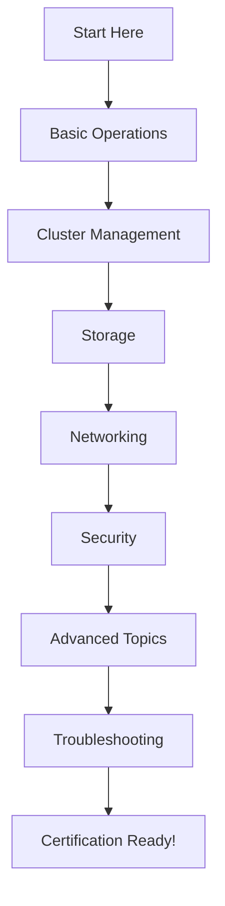

# 🚀 Kubernetes Study Guide - CKA/CKAD Preparation

*Your comprehensive guide to mastering Kubernetes for certification and real-world scenarios*

---

## 📋 Table of Contents

- [🎯 Overview](#-overview)
- [🛠️ Basic Operations](#️-basic-operations)
- [⚙️ Cluster Management](#️-cluster-management)
- [💾 Storage](#-storage)
- [🌐 Networking](#-networking)
- [🔐 Security](#-security)
- [🚀 Advanced Topics](#-advanced-topics)
- [🔧 Troubleshooting](#-troubleshooting)
- [📚 Study Structure](#-study-structure)
- [🎓 Certification Tips](#-certification-tips)
- [🤝 Contributing](#-contributing)

---

## 🎯 Overview

This comprehensive study guide is designed to help you master Kubernetes concepts for both **CKA (Certified Kubernetes Administrator)** and **CKAD (Certified Kubernetes Application Developer)** certifications. Whether you're a beginner or looking to sharpen your skills, this guide provides practical, hands-on examples that you can run in your own cluster.

### ✨ What Makes This Guide Special

- 🎯 **Exam-Focused**: Questions mirror real CKA/CKAD exam scenarios
- 💻 **Hands-On**: Every concept includes practical examples
- 📖 **Dual Approach**: Both command-line and YAML solutions
- ✅ **Verification Steps**: Confirm your work with validation commands
- 🌟 **Best Practices**: Industry-standard approaches and real-world scenarios

---

## 🛠️ Basic Operations

<strong>🔽 Click to expand - Master the fundamentals</strong>

### What You'll Learn:
- **Scaling Deployments** - Horizontal scaling strategies and techniques
- **Multi-Container Pods** - Sidecar patterns and container orchestration
- **Resource Monitoring** - CPU, memory, and storage monitoring techniques

### 🎯 Key Skills Covered:
- Deployment creation and management
- Pod lifecycle management
- Resource allocation and limits
- Container communication patterns
- Monitoring and observability

### 📊 Practical Examples:
- Creating deployments with replica management
- Building multi-container applications
- Implementing resource quotas and limits
- Setting up monitoring dashboards

---

## ⚙️ Cluster Management

<strong>🔽 Click to expand - Master cluster operations</strong>

### What You'll Learn:
- **Cluster Upgrades** - Zero-downtime upgrade strategies
- **ETCD Backup/Restore** - Data persistence and disaster recovery
- **Node Troubleshooting** - Diagnosing and fixing node issues

### 🎯 Key Skills Covered:
- Kubernetes version management
- Control plane maintenance
- Node management and troubleshooting
- Backup and recovery procedures
- Health monitoring and alerting

### 🔧 Real-World Scenarios:
- Upgrading production clusters
- Recovering from ETCD failures
- Handling node failures and maintenance
- Implementing backup strategies

---

## 💾 Storage

<strong>🔽 Click to expand - Master persistent storage</strong>

### What You'll Learn:
- **PVC Creation** - Persistent Volume Claims and storage classes
- **Volume Attachment** - Mounting storage to pods
- **Dynamic Resizing** - Expanding storage without downtime

### 🎯 Key Skills Covered:
- Storage class configuration
- Volume provisioning strategies
- Data persistence patterns
- Storage performance optimization
- Backup and snapshot management

### 💡 Practical Applications:
- Database storage solutions
- File sharing between pods
- Stateful application deployment
- Storage migration strategies

---

## 🌐 Networking

<strong>🔽 Click to expand - Master cluster networking</strong>

### What You'll Learn:
- **Ingress Rules** - External traffic routing and load balancing
- **Network Policies** - Micro-segmentation and security
- **Named Port Services** - Service discovery and communication

### 🎯 Key Skills Covered:
- Traffic routing and load balancing
- Network security implementation
- Service mesh concepts
- DNS and service discovery
- SSL/TLS termination

### 🔗 Network Patterns:
- Microservices communication
- Zero-trust networking
- Multi-tier application architecture
- Cross-cluster communication

---

## 🔐 Security

<strong>🔽 Click to expand - Master Kubernetes security</strong>

### What You'll Learn:
- **RBAC Implementation** - Role-based access control
- **Service Accounts** - Application identity management
- **Cluster Roles & Bindings** - Permission management

### 🎯 Key Skills Covered:
- Authentication and authorization
- Security policy implementation
- Secrets management
- Pod security standards
- Network security

### 🛡️ Security Best Practices:
- Principle of least privilege
- Secrets encryption
- Image security scanning
- Runtime security monitoring

---

## 🚀 Advanced Topics

<strong>🔽 Click to expand - Master advanced concepts</strong>

### What You'll Learn:
- **Static Pods** - Node-level pod management
- **Sidecar Containers** - Advanced container patterns
- **JSONPath Usage** - Advanced query techniques

### 🎯 Key Skills Covered:
- Advanced scheduling techniques
- Custom resource definitions
- Operator patterns
- Advanced networking concepts
- Performance optimization

### 🔥 Advanced Patterns:
- Custom controllers
- Admission controllers
- Advanced scheduling
- Multi-cluster management

---

## 🔧 Troubleshooting

<strong>🔽 Click to expand - Master debugging skills</strong>

### What You'll Learn:
- **Log Analysis** - Centralized logging and analysis
- **Node Issues** - Diagnosing infrastructure problems
- **Debugging Techniques** - Systematic problem-solving

### 🎯 Key Skills Covered:
- Systematic debugging approaches
- Performance troubleshooting
- Network connectivity issues
- Resource constraint problems
- Application debugging

### 🩺 Diagnostic Tools:
- kubectl debugging commands
- Log aggregation tools
- Monitoring and alerting
- Performance profiling

---

## 📚 Study Structure

### 🎯 Each Section Includes:

| Component | Description | Benefits |
|-----------|-------------|----------|
| **🎓 Clear Questions** | Exam-style questions that mirror CKA/CKAD scenarios | Practice with realistic exam formats |
| **📝 Detailed Answers** | Comprehensive solutions with explanations | Understand the 'why' behind each solution |
| **💻 Command-Line Approach** | kubectl commands and shell scripts | Master imperative operations |
| **📄 YAML Approach** | Declarative configuration files | Learn infrastructure as code |
| **🏃 Practical Examples** | Real-world scenarios you can run | Hands-on learning experience |
| **✅ Verification Steps** | Commands to confirm your work | Build confidence in your solutions |

### 🎯 Learning Path:

---

## 🎓 Certification Tips

### 🏆 CKA Exam Focus Areas:
- **25%** - Cluster Architecture, Installation & Configuration
- **15%** - Workloads & Scheduling
- **20%** - Services & Networking
- **10%** - Storage
- **30%** - Troubleshooting

### 🏆 CKAD Exam Focus Areas:
- **13%** - Application Design and Build
- **20%** - Application Deployment
- **20%** - Application Observability and Maintenance
- **25%** - Application Environment, Configuration and Security
- **22%** - Services & Networking

### 💡 Pro Tips:
- ⚡ **Speed**: Practice with time constraints
- 🎯 **Accuracy**: Double-check your work
- 📚 **Documentation**: Know the official Kubernetes docs
- 🔄 **Practice**: Repeat scenarios until muscle memory develops

---

## 🔥 Quick Start

### Prerequisites:
- Kubernetes cluster (local or cloud)
- kubectl configured
- Basic understanding of containers

---

## 🌟 Features

| Feature | Description |
|---------|-------------|
| 🎯 **Exam-Ready** | Questions designed to match certification exams |
| 💻 **Hands-On** | Practical examples you can run immediately |
| 📖 **Comprehensive** | Covers all major Kubernetes concepts |
| ✅ **Verified** | All examples tested and validated |
| 🔄 **Updated** | Regularly updated with latest Kubernetes versions |
| 🎓 **Educational** | Detailed explanations and best practices |

---

## 🤝 Contributing

We welcome contributions! Please see our [Contributing Guide](CONTRIBUTING.md) for details.

### Ways to Contribute:
- 📝 Add new examples
- 🐛 Fix bugs or typos
- 📖 Improve documentation
- 🎯 Add exam scenarios
- 💡 Suggest improvements

---

## 📊 Study Progress Tracker

Use this checklist to track your progress:

### Basic Operations
- [ ] Scaling deployments
- [ ] Multi-container pods
- [ ] Resource monitoring

### Cluster Management
- [ ] Cluster upgrades
- [ ] ETCD backup/restore
- [ ] Node troubleshooting

### Storage
- [ ] PVC creation and attachment
- [ ] Storage resizing
- [ ] Storage classes

### Networking
- [ ] Ingress configuration
- [ ] Network policies
- [ ] Service creation

### Security
- [ ] RBAC implementation
- [ ] Service accounts
- [ ] Security policies

### Advanced Topics
- [ ] Static pods
- [ ] Sidecar containers
- [ ] JSONPath queries

### Troubleshooting
- [ ] Log analysis
- [ ] Node debugging
- [ ] Application troubleshooting

---

## 📜 License

This project is licensed under the MIT License - see the [LICENSE](LICENSE) file for details.

---

**⭐ Star this repository if it helped you!**

---

**Made with ❤️ for the Kubernetes community**

[⬆ Back to top](#-kubernetes-study-guide---ckackad-preparation)

